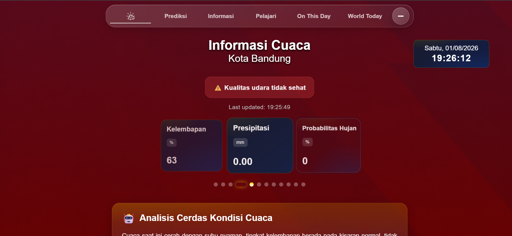
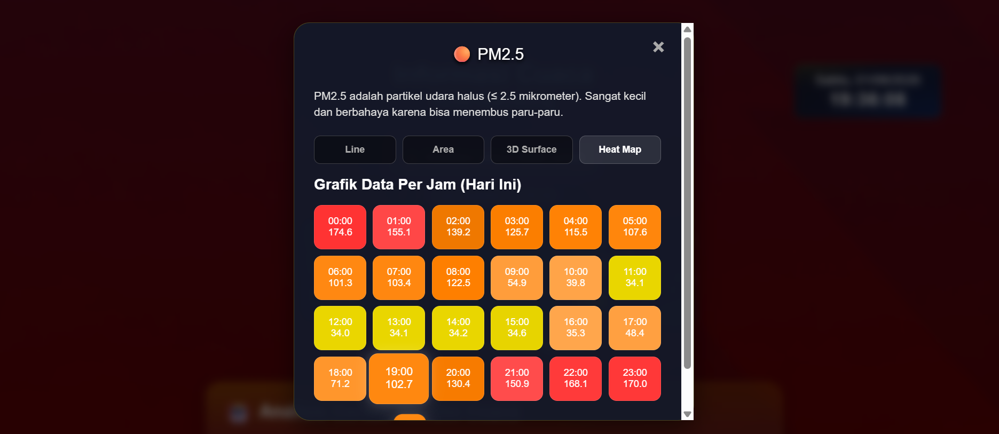
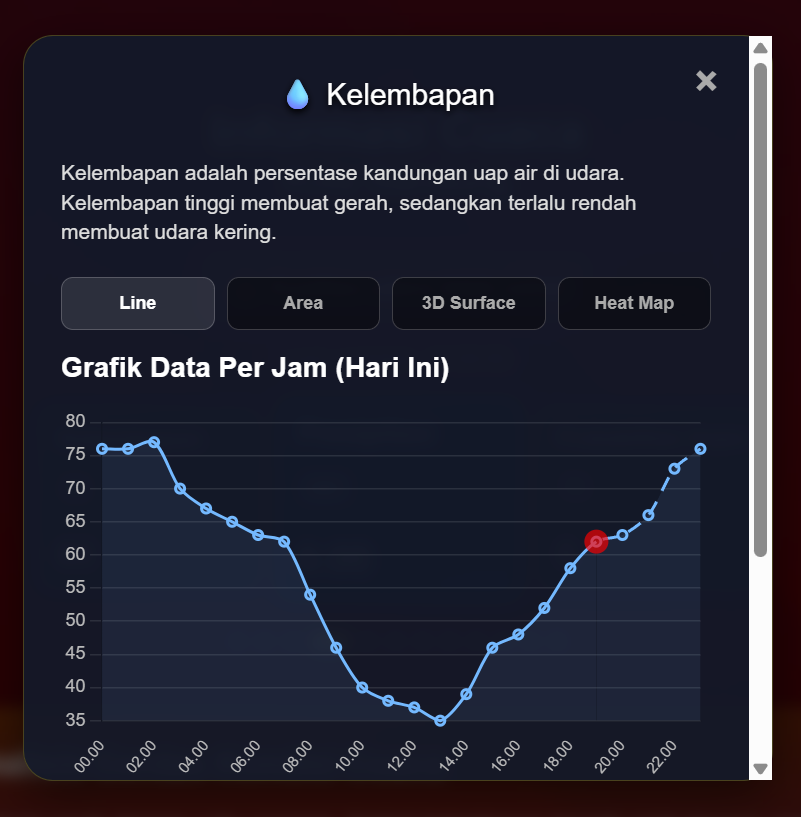

# ☀️ Informasi Cuaca

  

<h3 align="center">
🌤️ Dashboard Cuaca Modern • Real-Time • Interaktif
</h3>

Aplikasi web cuaca dengan visual premium yang menggabungkan data meteorologi, kualitas udara, grafik interaktif, dan informasi fenomena alam dalam satu dashboard.

---

## 🌐 Live Demo

🚀 Coba langsung:

https://bepora111-cyber.github.io/informasi-cuaca/

---

# 🌟 Tentang Project

**Informasi Cuaca** adalah dashboard cuaca modern yang dirancang untuk memberikan pengalaman melihat kondisi atmosfer secara lebih menarik.

Tidak hanya menampilkan suhu, tetapi juga menghadirkan:

- 🌦️ Kondisi cuaca real-time
- 📅 Prediksi 7 hari
- 🌫️ Kualitas udara
- 📊 Visualisasi data
- 🌎 Informasi bumi & luar angkasa

Semua dikemas dengan tampilan **glassmorphism modern yang responsif**.

---

# ✨ Fitur Unggulan

| Fitur | Deskripsi |
|---|---|
| 🌤️ Real-Time Weather | Kondisi cuaca terkini |
| 📅 Forecast 7 Hari | Prediksi cuaca mendatang |
| 🌫️ Air Quality | Monitoring polusi udara |
| 📊 Interactive Chart | Grafik atmosfer dinamis |
| 🌍 World Information | Gempa, astronomi, sejarah |
| 🌙 Dynamic Theme | Tema berdasarkan waktu |

---

# 🌤️ Cuaca Real-Time

Menampilkan:

- 🌡️ Temperatur
- 💧 Kelembapan
- 🌧️ Presipitasi
- ☔ Probabilitas hujan
- 💨 Kecepatan angin
- ☀️ UV Index
- 👁️ Visibility
- 🌅 Sunrise & Sunset

---

# 📅 Forecast 7 Hari

Setiap hari dapat dipilih untuk melihat detail:

- Temperatur
- Kelembapan
- Angin
- Curah hujan
- Probabilitas hujan
- Kondisi atmosfer

---

# 🌫️ Air Quality Monitoring

Data kualitas udara:

- PM2.5
- PM10
- CO
- NO₂
- SO₂
- US AQI

Dengan indikator agar kondisi udara mudah dipahami.

---

# 📊 Data Visualization

Visualisasi menggunakan:

- 📈 Line Chart
- 📉 Area Chart
- 🌊 3D Surface
- 🔥 Heat Map

Membantu memahami perubahan cuaca berdasarkan waktu.

---

# 🌎 Informasi Dunia

Selain cuaca:

🚀 Berita astronomi  
🌎 Data gempa bumi  
📜 Peristiwa sejarah hari ini  

---

# 🎨 UI & Experience

Dibangun dengan konsep:

✨ Glassmorphism  
🌊 Liquid Card Design  
📱 Responsive Layout  
🌙 Automatic Dark Mode  
⚡ Smooth Animation  

Mendukung:

💻 Desktop  
📱 Mobile  

---

# ⚡ Performance Optimization

Dirancang agar tetap cepat:

- Cache data
- Optimasi animasi
- Rendering efisien
- Ringan untuk perangkat low-end
- Tidak membutuhkan instalasi

---

# 🛠️ Teknologi

### Frontend

- HTML5
- CSS3
- JavaScript
- Canvas API
- Chart.js

### API

- Open-Meteo Weather API
- Open-Meteo Air Quality API
- USGS Earthquake API
- Spaceflight News API
- Wikimedia API

---

# 📍 Data Location

Default:

📌 Bandung, Indonesia

Latitude : -6.9175
Longitude : 107.6191
Timezone : Asia/Jakarta

---

# 📷 Preview

## 💻 Desktop Version

## 📱 Mobile Version

---

# 🎯 Project Goal

Membuat pengalaman baru dalam melihat informasi cuaca dengan menggabungkan teknologi web modern, data real-time, dan desain visual interaktif.

---

# ⭐ Support

Jika project ini menarik:

⭐ Berikan star pada repository ini

dan jangan lupa mencoba demonya.

Terima kasih telah melihat **Informasi Cuaca ☀️**